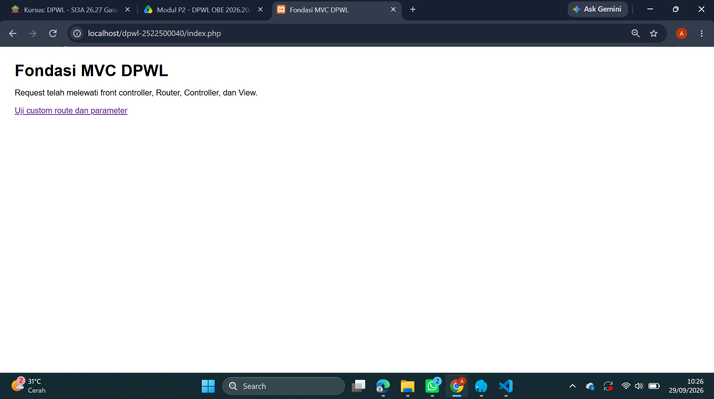
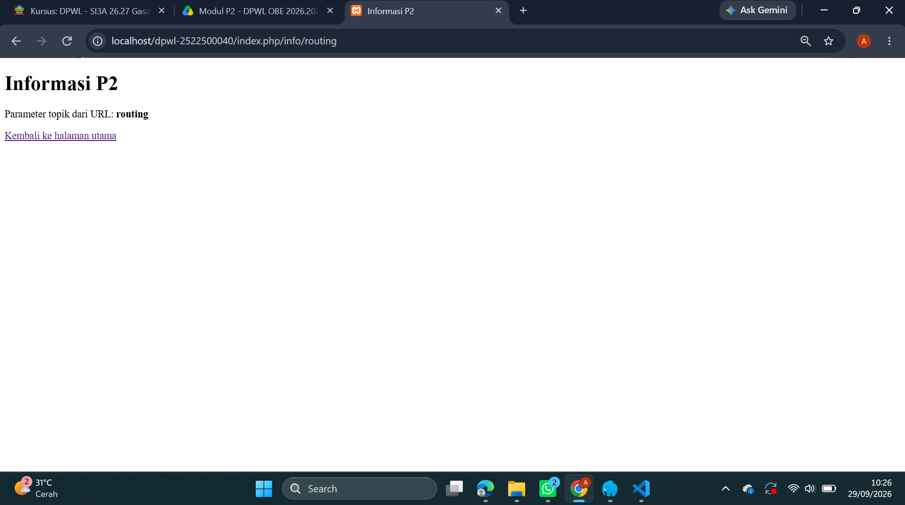
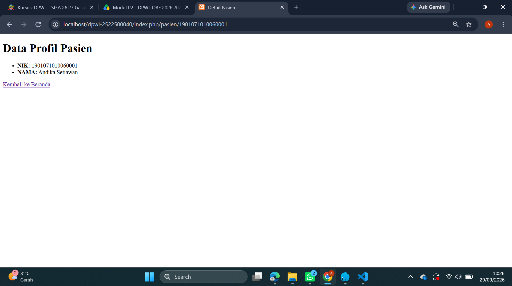

# pertemuan-02
## 1. Tujuan Praktikum
Tujuan dari pertemuan 2 ini adalah memahami fondasi kerangka kerja (framework) buatan sendiri yang berbasis arsitektur MVC (Model-View-Controller). Memahami alur dari setiap komponen dalam pengembangan aplikasi web, dan mampu menjelaskan alur interaksi antarkomponen berdasarkan rancangan yang diberikan.

## 2. Struktur Direktori
```text
pertemuan-02/
├── application/
│   ├── config/
│   │   ├── config.php      -> Mengatur konfigurasi dasar aplikasi (Base URL, dll)
│   │   └── routes.php      -> Mengatur pemetaan rute URL ke Controller
│   ├── controllers/
│   │   └── Home.php        -> Controller utama untuk menangani logika request
│   ├── helpers/
│   │   └── url_helper.php  -> Menyediakan fungsi bantuan base_url() dan site_url()
│   └── views/
│       └── home/
│           ├── index.php   -> View untuk halaman utama (beranda)
│           ├── info.php    -> View untuk menampilkan informasi routing
│           └── pasien.php  -> View kustom untuk profil pasien
├── assets/
│   └── css/
│       └── app.css         -> File stylesheet aset statis
├── system/                 -> Core framework MVC
└── index.php               -> Front Controller (pintu masuk utama aplikasi)
```
## 3. Front controller
index.php bertindak sebagai pintu gerbang utama (satu-satunya titik masuk) bagi siapa pun yang ingin mengakses aplikasi web kita.

## 4. Routing dan Pemetaan URL
| URL/Route | Controller | Method | Parameter | View |
|---|---|---|---|---|
| / | Home | index | - | home/index.php |
| home/index | Home | index | - | home/index.php |
| home/info/mvc | Home | info | mvc | home/info.php |
| info/routing | Home | info | routing | home/info.php |
| pasien/(:num) | Home | Pasien | $1 | Home/pasien.php |

**Penjelasan Pemetaan Rute Modifikasi ATM:**

Route (`pasien/(:num)`):Menangkap permintaan URL yang diawali kata `pasien/` dan diikuti oleh angka variabel `(:num)` (misalnya NIK `1901071010060001`).

Controller (`Home`):Menunjuk ke kelas `Home` pada berkas `application/controllers/Home.php`.

Method (`Pasien`): Mengeksekusi fungsi/method `pasien()` di dalam Controller `Home`.

Parameter (`$1`):Nilai angka NIK dari URL ditangkap oleh wildcard `(:num)` dan dikirim sebagai argumen ke method `pasien($nik)`.
(`home/pasien.php`):Controller mengolah data profil (NIK: 1901071010060001, Nama: Andika Setiawan) 

lalu memuat tampilan akhir pada file View `home/pasien.php`.

## 5. Base URL dan Helper
- **`base_url()`**: Berfungsi untuk menghasilkan URL dasar (*root URL*) proyek yang mengarah ke lokasi folder atau file fisik statis di direktori publik.
  - **Contoh Penggunaan P2:** Memanggil file stylesheet CSS pada file View (`application/views/home/index.php`):
    php
    <link rel="stylesheet" href="<?= base_url('assets/css/app.css'); ?>">
    

- **`site_url()`**: Berfungsi untuk membentuk URL navigasi internal aplikasi yang terintegrasi dengan Front Controller (`index.php`) dan sistem routing.
  - **Contoh Penggunaan P2:** Membentuk link navigasi rute pada View:
    php
    <!-- Navigasi ke rute kustom -->
    <a href="<?= site_url('info/routing'); ?>">Uji custom route</a>

    <!-- Navigasi kembali ke beranda -->
    <a href="<?= site_url(); ?>">Kembali ke Beranda</a>
    ```


## 6. Alur Request-response
1. *Alur Eksekusi Aktual P2:*  
   Browser $\rightarrow$ index.php $\rightarrow$ Router $\rightarrow$ Controller $\rightarrow$ View $\rightarrow$ Response  
   Penjelasan: Permintaan dari browser ditangkap oleh index.php (Front Controller). Router memetakan URL ke Controller Home[cite: 1]. Controller memproses request, menyiapkan data, lalu memuat file View yang dikembalikan sebagai response tampilan HTML ke browser.

2. *Posisi Model dalam Arsitektur MVC Lengkap:*  
   Browser $\rightarrow$ index.php $\rightarrow$ Router $\rightarrow$ Controller $\rightarrow$ Model $\rightarrow$ basis data/data $\rightarrow$ Model $\rightarrow$ Controller $\rightarrow$ View $\rightarrow$ Response  
   Penjelasan: Dalam arsitektur lengkap, Controller meminta Model untuk mengambil atau mengolah data dari basis data (MySQL). Setelah data diproses oleh Model dan dikembalikan ke Controller, Controller akan meneruskannya ke View untuk dirender menjadi response.

Catatan: Pada implementasi P2, Model belum digunakan karena akses dan pengelolaan basis data baru mulai diimplementasikan pada P3.


## 7. Hasil Pengujian dan Debugging
* *Pengujian Valid:*
  * *Halaman Utama (/index.php):* Berhasil memuat beranda lengkap dengan gaya CSS dari base_url().
  * *Navigasi Route (/info/routing):* Berhasil berpindah halaman menggunakan fungsi site_url().
  * *Custom Route (/pasien/1901071010060001):* Berhasil menampilkan data profil pasien (NIK: 1901071010060001, Nama: Andika Setiawan).

* *Pengujian Tidak Valid:*
  * *Akses Parameter Non-Angka (/pasien/abc):* Halaman menampilkan error/404 karena rute pasien/(:num) dikonfigurasi khusus hanya menerima parameter berupa angka (:num).

* *Proses Debugging:*
  * *Gejala:* Tampilan data profil pada peramban tidak mengalami perubahan/perbaruan meskipun kodingan pada file Controller telah disesuaikan.
  * *Penyebab:* Berkas kodingan pada VS Code belum tersimpan (unsaved) serta adanya cache halaman lama pada peramban.
  * *Perbaikan:* Melakukan penyimpanan seluruh berkas (Ctrl + S) dan mengeksekusi hard refresh (Ctrl + F5) pada peramban.
  * *Hasil Uji Ulang:* Halaman web berhasil menampilkan data profil pasien secara dinamis dan diperbarui.

  * *Hasil Uji Ulang:* Halaman web berhasil menampilkan data profil pasien secara dinamis dan diperbarui.

## 8. Bukti Tangkapan Layar
Sisipkan gambar yang relevan dari folder dokumentasi/ dengan perintah:
### Gambar 1. Hasil Pengujian Halaman Utama

### Gambar 2. Hasil Pengujian Custom Route

### Gambar 3. Data Profil Pasien


## 9. Kesimpulan P2
Pada praktikum P2 ini, kerangka kerja PHP MVC kustom telah berhasil dipelajari dan diimplementasikan untuk membangun fondasi dasar aplikasi web. Beberapa hal yang sudah dapat dilakukan oleh kerangka kerja MVC pada tahap ini meliputi:
1. *Front Controller (index.php):* Mampu menangani seluruh lalu lintas permintaan (request) yang masuk sebagai satu titik akses terpusat.
2. *Sistem Routing:* Mampu memetakan URL biasa maupun custom route (seperti /pasien/(:num)) secara dinamis untuk diteruskan ke Controller dan Method yang sesuai.
3. *Helper (base_url() dan site_url()):* Mampu mempermudah pemanggilan aset statis (file CSS) dan pembentukan tautan navigasi internal antar-halaman.
4. *Pemisahan Logika dan Tampilan:* Mampu memisahkan antarmuka pengguna (View) dari logika proses (Controller).

*Pengembangan pada P3:*
Pada P2 ini, komponen *Model* belum digunakan sehingga data yang ditampilkan pada View masih bersifat statis (hardcoded). Pada praktikum P3 mendatang, kerangka kerja ini akan dilengkapi dengan komponen *Model* untuk menangani integrasi basis data (MySQL), pengelolaan query data, serta pemrosesan data yang dinamis.
